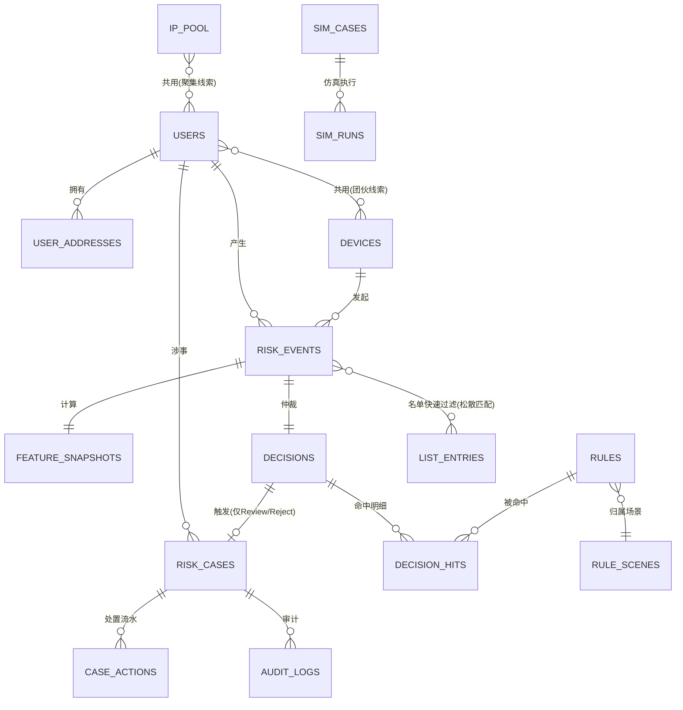
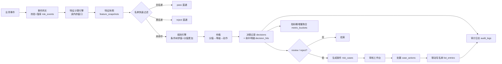

# 电商风险控制系统 · 数据实体设计

> **文档编号**：01_数据实体
> **所属项目**：shop_risk_control（对应 PRD 2.3 电商风险控制系统）
> **依据**：`Spec_coding_步骤/PRD.md`
> **状态**：Step 1 产物 · 待评审

---

## 0. 文档约定

| 项 | 约定 |
|---|---|
| 存储形态 | **MongoDB 为主库**（集合 + 文档）；热特征走**进程内内存** |
| 命名 | 集合名小写下划线复数；字段名小写下划线；枚举值小写英文 |
| 主键 | 业务实体统一用 `_id`（业务编号）+ 独立 `id` 字段不作为主键 |
| 时间 | 统一 `ts`（毫秒时间戳）存储，展示层再格式化 |
| 金额 | 统一 `amount`，单位**分**（整数），避免浮点误差 |
| 空值 | 缺失用 `null`，不用 `""` 或 `0` 冒充 |
| 审计 | 所有写操作记录 `created_by` / `created_at` / `updated_by` / `updated_at` |

**三条贯穿全局的设计原则**

1. **事件不可变**：`risk_events` 一旦写入不更新（风控取证要求原始证据不可篡改）。
2. **快照与事件分离**：事件只存原始入参，特征快照单独存并带 `window_config`，保证"同一事件在规则变更后仍能复算"。
3. **决策可重放**：`decisions` 记录当时的规则版本号集合，任何一条历史决策都能用当时版本重放验证。

---

## 1. 领域模型总览



---

## 2. 实体清单

| # | 实体 | 集合名 | 归属模块 | 说明 |
|---|---|---|---|---|
| E01 | 风控事件 | `risk_events` | 事件网关 | 五类业务事件原始入参，**不可变** |
| E02 | 特征快照 | `feature_snapshots` | 特征计算引擎 | 事件在决策时刻的多维特征键值快照 |
| E03 | 决策记录 | `decisions` | 规则决策引擎 | 一次仲裁的完整结论 + 规则版本集合 |
| E04 | 决策命中明细 | `decision_hits` | 规则决策引擎 | 命中了哪条规则、各贡献多少分 |
| E05 | 风控规则 | `rules` | 规则决策引擎 | 规则定义与分值，可版本化 |
| E06 | 规则场景 | `rule_scenes` | 规则决策引擎 | 规则分类（领券/下单/支付/售后/登录） |
| E07 | 名单条目 | `list_entries` | 规则决策引擎 | 黑/白/灰名单，多实体维度 |
| E08 | 风控案件 | `risk_cases` | 案件流转 | Review/Reject 自动生成，带状态机 |
| E09 | 案件处置流水 | `case_actions` | 案件流转 | 放行/拦截/拉黑/封禁动作留痕 |
| E10 | 用户 | `users` | 画像与图谱 | 涉事用户主数据 + 风险标签 |
| E11 | 设备 | `devices` | 画像与图谱 | 设备环境指纹 |
| E12 | IP 池 | `ip_pool` | 画像与图谱 | IP 归属与代理标记 |
| E13 | 收货地址 | `user_addresses` | 画像与图谱 | 收货地址聚集度分析基础 |
| E14 | 实体关联边 | `entity_edges` | 画像与图谱 | 用户↔设备↔IP↔地址 关联网络 |
| E15 | 监控指标桶 | `metric_buckets` | 监控与审计 | 时间窗口聚合，供大盘查询 |
| E16 | 审计日志 | `audit_logs` | 监控与审计 | 全量操作/变更留痕，哈希链防篡改 |
| E17 | 仿真用例 | `sim_cases` | 仿真测试 | 仿真测试页的用例模板 |
| E18 | 仿真执行记录 | `sim_runs` | 仿真测试 | 单次模拟检测的链路回放结果 |
| E19 | 系统用户 | `sys_users` | 权限 | 审核员/策略师/管理员账号 |
| E20 | 模型配置（预留） | `model_configs` | 决策引擎 | 为"模型引擎"预留，当前空实现 |
| E21 | 特征基线 | `feature_baselines` | 监控与审计 | 各特征的正常水平分位值（P50/P95），供人工研判做「本次值 vs 基线」对照（**决策 D9 新增**） |

---

## 3. 核心实体字段设计

### E01 · 风控事件 `risk_events`

**用途**：接收业务系统传入的五类事件，是整条决策链路的输入与不可篡改的原始证据。

| 字段 | 类型 | 必填 | 说明 |
|---|---|:--:|---|
| `_id` | string | ✔ | 事件编号，格式 `EVT{yyyyMMdd}{12位序列}` |
| `event_type` | enum | ✔ | `login` / `coupon_receive` / `order_create` / `order_pay` / `after_sale_apply` |
| `user_id` | string | ✔ | 涉事用户编号 |
| `biz_no` | string |  | 业务单据号（订单号/券ID/售后单号） |
| `device_id` | string |  | 设备指纹 ID |
| `ip` | string |  | 请求来源 IP（IPv4/IPv6） |
| `phone` | string |  | 收货/注册手机号（脱敏存储） |
| `address_id` | string |  | 收货地址 ID |
| `amount` | int |  | 金额，单位分（领券面额/订单额/退款额） |
| `scene_extra` | object |  | 场景扩展 KV，按 `event_type` 不同而不同（见下） |
| `ts` | long | ✔ | 事件发生时间戳（毫秒） |
| `received_at` | long | ✔ | 系统接收时间戳（毫秒，用于算链路延迟） |
| `source` | string |  | 来源系统标识，默认 `mock_biz`（模拟事件流） |

**`scene_extra` 按事件类型的差异**

| event_type | 关键扩展字段 |
|---|---|
| `login` | `login_type`(pwd/sms/scan), `ua`, `success` |
| `coupon_receive` | `coupon_id`, `face_value`, `activity_id`, `batch_id` |
| `order_create` | `order_no`, `sku_count`, `total_amount`, `address_id` |
| `order_pay` | `order_no`, `pay_channel`, `pay_amount`, `card_tail` |
| `after_sale_apply` | `after_sale_no`, `order_no`, `reason_code`, `refund_amount`, `received_goods` |

> ⚠️ **PRD 悬空点 G-07**：PRD 未定义五类事件各自的必填字段集。上表是我按电商常识补的，**需评审确认**。

**索引**

| 索引 | 字段 | 用途 |
|---|---|---|
| 唯一 | `_id` | 主键 |
| 复合 | `user_id + ts desc` | 用户行为回溯 |
| 复合 | `device_id + ts desc` | 设备聚集分析 |
| 复合 | `ip + ts desc` | IP 聚集分析 |
| 复合 | `event_type + ts desc` | 大盘按类型统计 |
| TTL | `ts`（可选，保留 90 天） | 冷数据清理 |

---

### E02 · 特征快照 `feature_snapshots`

**用途**：记录决策时刻该事件的**全量特征键值**。这是 PRD 2.3.8 明确要求的输出项，也是"人工复核时看证据"的核心依据。

| 字段 | 类型 | 必填 | 说明 |
|---|---|:--:|---|
| `_id` | string | ✔ | 快照编号 `SNP{yyyyMMdd}{12位序列}` |
| `event_id` | string | ✔ | 关联 `risk_events._id` |
| `user_id` | string | ✔ | 冗余，便于直接按用户查 |
| `features` | object | ✔ | **特征键值对**，见下 |
| `window_config` | object | ✔ | 本次计算用的窗口配置（用于复算） |
| `computed_at` | long | ✔ | 计算完成时间戳 |
| `compute_ms` | int |  | 特征计算耗时（毫秒），供性能监控 |
| `missing_features` | array |  | 因数据不足未能计算的特征名列表（**新事件冷启动时很重要**） |

**`features` 键值结构**（约 18 项，分五组）

| 分组 | 特征名 | 含义 |
|---|---|---|
| 行为频次 | `login_cnt_1h` | 近 1 小时登录次数 |
| | `coupon_cnt_1h` | 近 1 小时领券次数 |
| | `order_cnt_1h` | 近 1 小时下单次数 |
| | `order_cnt_24h` | 近 24 小时下单次数 |
| | `pay_fail_cnt_24h` | 近 24 小时支付失败次数 |
| | `aftersale_cnt_24h` | 近 24 小时售后申请次数 |
| | `aftersale_rate_24h` | 近 24 小时退款率 = 售后数 / 订单数 |
| 设备环境 | `device_user_cnt` | 同设备关联的账号数（**团伙核心指标**） |
| | `device_order_cnt_1h` | 近 1 小时同设备下单次数 |
| | `device_age_hours` | 设备首次出现至今小时数（新设备风险高） |
| 网络 IP | `ip_user_cnt` | 同 IP 注册/登录账号数 |
| | `ip_order_cnt_1h` | 近 1 小时同 IP 下单次数 |
| | `ip_is_proxy` | 是否代理/机房 IP（bool） |
| 地址聚集 | `address_user_cnt` | 同收货地址关联账号数 |
| | `address_aftersale_cnt` | 同地址历史退款次数 |
| 账号画像 | `user_age_days` | 账号注册至今天数 |
| | `user_level` | 用户等级 |
| | `user_risk_tag_cnt` | 已挂风险标签数量 |

**`window_config` 结构**

```json
{
  "short_window_min": 60,
  "long_window_min": 1440,
  "agg_mode": "in_memory_sliding",
  "config_version": "w1"
}
```

> ⚠️ **PRD 悬空点 G-02**：PRD 只举例"近 1 小时""近 24 小时"，未确认是否为最终值。上表按举例值固化，**需评审确认**。

**索引**：唯一 `event_id`；复合 `user_id + computed_at desc`。

---

### E03 · 决策记录 `decisions`

**用途**：一次仲裁的完整结论。是"结果输出格式"（PRD 2.3.8）中「决策结果」的落库形态。

| 字段 | 类型 | 必填 | 说明 |
|---|---|:--:|---|
| `_id` | string | ✔ | 决策编号 `DEC{yyyyMMdd}{12位序列}` |
| `event_id` | string | ✔ | 关联事件 |
| `snapshot_id` | string | ✔ | 关联特征快照 |
| `list_hit` | object |  | 名单直通结果 `{hit:bool, list_type, entity_type, entity_value}` |
| `rule_score` | int | ✔ | 规则引擎得分（0~100，**累加后截断**） |
| `model_score` | int \| null |  | **模型引擎得分（预留，当前恒为 null）** |
| `final_score` | int | ✔ | 融合后终分（当前 = `rule_score`） |
| `risk_level` | enum | ✔ | `low` / `medium` / `high` |
| `decision` | enum | ✔ | `pass` / `review` / `reject` |
| `hit_rule_count` | int | ✔ | 命中规则条数 |
| `rule_versions` | object | ✔ | `{rule_code: version}` 快照，**保证决策可重放** |
| `engine_version` | string | ✔ | 决策引擎版本，如 `rule-engine-v1` |
| `degraded` | bool |  | 是否发生降级（名单/规则依赖不可用）。**降级时 `decision` 仍写 `review`，并据此正常建案**（决策 D5）——避免降级请求无人处理 |
| `elapsed_ms` | int |  | 决策链路总耗时 |
| `decided_at` | long | ✔ | 决策时间戳 |

**分值区间（已确认三档，不做 Challenge）**

| 区间 | 等级 | 动作 |
|---|---|---|
| 0 ~ 59 | `low` | `pass` 放行 |
| 60 ~ 79 | `medium` | `review` 转人工审核 |
| 80 ~ 100 | `high` | `reject` 直接拦截 |

**名单直通优先级**（PRD 2.3.4 明确）

```
白名单命中 → 直接 pass（不算分、不判规则）
黑名单命中 → 直接 reject（不算分、不判规则）
两者都命中 → 按 PRD 未定义，暂定【黑名单优先】(G-04)
```

> ⚠️ **PRD 悬空点 G-03**：多条规则分值累加**超过 100** 时如何处理？PRD 只给 80~100 区间。本设计取**截断到 100**，需确认是否改为"不设上限、按实际分显示"。
>
> ⚠️ **PRD 悬空点 G-04**：黑白名单**同时命中**的优先级未定义，暂定黑名单优先。

**索引**：唯一 `event_id`；复合 `decided_at desc`；复合 `decision + decided_at desc`。

---

### E04 · 决策命中明细 `decision_hits`

| 字段 | 类型 | 说明 |
|---|---|---|
| `_id` | string | 明细编号 |
| `decision_id` | string | 关联决策 |
| `event_id` | string | 冗余，便于按事件查 |
| `rule_code` | string | 命中规则编码 |
| `rule_name` | string | 规则名称（**冗余快照**，规则改名后历史记录不变） |
| `rule_version` | int | 命中的规则版本 |
| `score` | int | 该规则贡献分值 |
| `reason` | string | 触发原因描述（PRD 2.3.8 要求） |
| `matched_facts` | object | 命中的特征实际值，如 `{device_user_cnt: 12}` |
| `hit_at` | long | 命中时间戳 |

> **设计要点**：`rule_name` / `score` 做**冗余快照**而非仅存 `rule_code`。因为规则会被改分、改名、停用，若只存引用，历史决策的解释会随规则变更而失真——这与"决策可重放"原则冲突。

**索引**：复合 `decision_id`；复合 `rule_code + hit_at desc`（用于规则命中排行）。

---

### E05 · 风控规则 `rules`

| 字段 | 类型 | 必填 | 说明 |
|---|---|:--:|---|
| `_id` | string | ✔ | 规则编码 `R{场景码}{3位序号}`，如 `RCOUPON001` |
| `name` | string | ✔ | 规则名称 |
| `scene_code` | string | ✔ | 归属场景，关联 `rule_scenes` |
| `description` | string |  | 规则说明 |
| `condition` | object | ✔ | **条件树**（见下） |
| `score` | int | ✔ | 命中后累加分值（0~100） |
| `status` | enum | ✔ | `enabled` / `disabled` |
| `priority` | int |  | 执行优先级（小者先算，用于短路优化） |
| `version` | int | ✔ | 版本号，每次修改 +1 |
| `is_system` | bool |  | 系统内置规则（不可删，只能停用） |
| `created_by` / `updated_by` | string |  | 操作人 |
| `created_at` / `updated_at` | long | ✔ | 时间戳 |

**`condition` 条件树结构**（递归）

```json
{
  "logic": "and",
  "children": [
    { "field": "device_user_cnt",   "op": "gte", "value": 5 },
    { "field": "user_age_days",     "op": "lt",  "value": 3 },
    {
      "logic": "or",
      "children": [
        { "field": "ip_is_proxy",     "op": "eq",  "value": true },
        { "field": "coupon_cnt_1h",   "op": "gte", "value": 3 }
      ]
    }
  ]
}
```

**支持的算子**：`eq` `ne` `gt` `gte` `lt` `lte` `in` `not_in` `exists` `contains`

> **设计要点**：条件树**不用字符串表达式**（如 `device_user_cnt >= 5 AND ...`）。字符串表达式要么自己写解析器（易出安全与一致性问题），要么用 `eval`（安全禁区）。JSON 树可被前端"条件树构建器"直接双向绑定，且天然免疫注入。

**索引**：唯一 `_id`；复合 `scene_code + status + priority`。

---

### E06 · 规则场景 `rule_scenes`

| 字段 | 类型 | 说明 |
|---|---|---|
| `_id` | string | 场景码：`login` / `coupon` / `order` / `pay` / `aftersale` / **`common`** |
| `name` | string | 场景名称（登录/领券/下单/支付/售后/**通用**） |
| `event_types` | array | 该场景适用的 `event_type` 列表 |
| `sort` | int | 展示排序 |

> **`common`（通用场景）** —— 由**决策 D10 引入**（PRD 未定义）。
> 所有事件类型都会求值该场景下的规则，用于表达跨场景的通用风险（代理 IP、设备聚集等）。
> **编码约束**：必须以 `rule_scenes` 里的**数据行**形式存在，**禁止在代码里对字符串 `common` 做特判**。

---

### E07 · 名单条目 `list_entries`

| 字段 | 类型 | 必填 | 说明 |
|---|---|:--:|---|
| `_id` | string | ✔ | 名单条目 ID |
| `list_type` | enum | ✔ | `black` / `white` / `gray` |
| `entity_type` | enum | ✔ | `user` / `phone` / `ip` / `device` / `address` |
| `entity_value` | string | ✔ | 实体值（手机号脱敏后存储） |
| `reason` | string |  | 加入原因 |
| `source` | string |  | 来源：`manual`（人工）/ `auto`（处置自动写入）/ `import`（批量导入） |
| `related_case_no` | string |  | 关联案件号（自动加入时） |
| `effective_at` | long | ✔ | 生效时间 |
| `expire_at` | long \| null |  | 失效时间，`null` = 永久 |
| `status` | enum | ✔ | `active` / `expired` / `removed` |
| `operator` | string | ✔ | 操作人（系统自动写 `system`） |

**唯一约束**：`list_type + entity_type + entity_value + status=active` 组合唯一（防重复加名单）。

> ⚠️ **PRD 悬空点 G-05**：PRD 提到"黑/白/灰名单"三tab，但**只定义了黑、白名单的行为**，灰名单既不拦截也不放行——**它到底做什么用？**（观察名单？只记录不干预？升级为黑名单的缓冲池？）本设计暂按"不参与决策、仅画像标注"处理，**需确认**。

**索引**：复合 `list_type + entity_type + entity_value`（决策链路**最高频查询**，必须建）；TTL/复合 `expire_at`（定时清理）。

---

### E08 · 风控案件 `risk_cases`

**用途**：Review / Reject 事件自动沉淀为案件，人工复核与处置的载体。

| 字段 | 类型 | 必填 | 说明 |
|---|---|:--:|---|
| `_id` | string | ✔ | 案件编号 `CASE{yyyyMMdd}{6位序列}` |
| `event_id` / `decision_id` | string | ✔ | 关联事件与决策 |
| `user_id` | string | ✔ | 涉事用户 |
| `scene_code` | string | ✔ | 场景 |
| `risk_score` | int | ✔ | 决策时的风险分（冗余快照） |
| `risk_level` | enum | ✔ | `medium` / `high` |
| `decision` | enum | ✔ | `review` / `reject` |
| `risk_tags` | array |  | 风险标签，如 `["device_cluster","new_account"]` |
| `status` | enum | ✔ | `pending` 待审 / `reviewing` 审核中 / `disposed` 已处置 / `archived` 已归档 |
| `assignee` | string \| null |  | 审核人（认领后写入） |
| `claimed_at` | long \| null |  | 认领时间 |
| `disposed_at` | long \| null |  | 处置完成时间 |
| `archived_at` | long \| null |  | 归档时间 |
| `estimated_loss` | int |  | 预估涉损金额（分），用于资损统计 |
| `created_at` | long | ✔ | 创建时间 |

**状态机**

```
pending ──认领──> reviewing ──处置──> disposed ──归档──> archived
   │                  │
   └─────超时自动回收──┘
```

> ⚠️ **PRD 悬空点 G-06**：PRD 未定义**认领后超时未处置**如何处理（是否自动回收为 `pending`？超时多久？）。本设计预留"超时回收"位，**需确认阈值**。

**索引**：唯一 `_id`；复合 `status + risk_level + created_at desc`（工作台列表主查询）；复合 `user_id + created_at desc`；唯一 `event_id`。

---

### E09 · 案件处置流水 `case_actions`

| 字段 | 类型 | 说明 |
|---|---|---|
| `_id` | string | 流水号 |
| `case_no` | string | 关联案件 |
| `action_type` | enum | `pass` 放行 / `block_order` 拦截订单 / `blacklist_user` 拉黑账号 / `ban_device` 封禁设备 / `reject_refund` 驳回退款 |
| `conclusion` | enum | 处理结论：`violation` 违规 / `normal` 正常 / `suspicious` 存疑 |
| `remark` | string | 处置原因备注（PRD 2.3.3 要求必填） |
| `evidence_refs` | array | 引用的证据（快照ID/关联账号列表） |
| `list_writes` | array | 本次联动写入的名单条目 `[{list_type, entity_type, entity_value}]` |
| `operator` | string | 处置人 |
| `operator_role` | string | 处置人角色 |
| `acted_at` | long | 处置时间戳 |
| `biz_sync_result` | object | 业务系统联动结果 `{target, status, message}` |

> ⚠️ **PRD 悬空点 G-08**：PRD 说处置后"联动更新业务订单状态"。但**当前没有真实业务系统**，只有模拟事件流。本设计把它设计成**可插拔的 `BizAdapter`**：默认 `mock` adapter 只记日志，将来可换真实 adapter。**需确认**。

---

### E10~E13 · 画像与图谱实体

**E10 `users`**

| 字段 | 类型 | 说明 |
|---|---|---|
| `_id` | string | 用户编号 `U{8位}` |
| `phone` | string | 注册手机号（脱敏） |
| `register_at` | long | 注册时间（算 `user_age_days`） |
| `level` | enum | `normal` / `silver` / `gold` / `vip` |
| `status` | enum | `active` / `frozen` / `banned` |
| `risk_tags` | array | 风险标签，如 `["device_cluster","blacklist_history"]` |
| `risk_score_history` | array | 最近 N 次决策分数（画风险趋势） |
| `stat` | object | 累计统计 `{order_cnt, aftersale_cnt, block_cnt, total_amount}` |

**E11 `devices`**：`_id`(device_id)、`fingerprint`、`first_seen_at`、`last_seen_at`、`os`、`ua`、`linked_user_cnt`、`risk_level`

**E12 `ip_pool`**：`_id`(ip)、`region`、`isp`、`is_proxy`、`is_idc`、`linked_user_cnt`、`first_seen_at`

**E13 `user_addresses`**：`_id`(address_id)、`user_id`、`receiver`、`phone`、`province`/`city`/`district`、`detail_hash`（**不存明文详细地址**）、`linked_user_cnt`、`aftersale_cnt`

---

### E14 · 实体关联边 `entity_edges`

**用途**：支撑 PRD 要求的"关联团伙图谱（同设备/同IP/同地址聚集账号）"。

| 字段 | 类型 | 说明 |
|---|---|---|
| `_id` | string | 边 ID |
| `from_type` / `from_id` | enum/string | 起点，如 `device` / `D123` |
| `to_type` / `to_id` | enum/string | 终点，如 `user` / `U456` |
| `relation` | enum | `used_device` / `shared_ip` / `shared_address` / `same_phone` / `transferred_to` |
| `weight` | int | 关联强度（共现次数） |
| `first_seen_at` / `last_seen_at` | long | 首末次共现时间 |
| `risk_flag` | bool | 该边是否已判定为风险关联 |

**设计要点**：用**独立边集合**而不是在 `users` 里内嵌数组。理由：团伙发现需要做**多跳遍历**（设备→其他用户→其他设备），独立边集合可对 `from_id` / `to_id` 双向建索引；内嵌数组会导致图谱查询要么全表扫、要么文档无限膨胀。

**索引**：复合 `from_type + from_id`；复合 `to_type + to_id`；唯一 `from_id + to_id + relation`。

---

### E15 · 监控指标桶 `metric_buckets`

**用途**：大盘的趋势图 / 分布图 / 排行。**不能在查询时对 `decisions` 全表聚合**（数据量增长后必崩），改为写入时增量聚合。

| 字段 | 类型 | 说明 |
|---|---|---|
| `_id` | string | `{bucket_type}:{bucket_key}:{ts}` |
| `bucket_type` | enum | `global` / `rule` / `level` / `scene` |
| `bucket_key` | string | 维度值（规则码/风险等级/场景码） |
| `bucket_ts` | long | 桶起始时间（按分钟对齐） |
| `granularity` | enum | `1m` / `1h` / `1d` |
| `metrics` | object | 见下 |

**`metrics` 结构**

```json
{
  "event_cnt": 1280, "pass_cnt": 1100, "review_cnt": 120, "reject_cnt": 60,
  "block_rate": 0.047, "avg_score": 23.5, "avg_elapsed_ms": 12,
  "estimated_saved_amount": 3580000
}
```

> ⚠️ **PRD 悬空点 G-09**：PRD 2.3.3 要求"预估挽回资损卡片"，但**未给计算公式**。本设计暂定 `estimated_saved_amount = Σ(被 reject 的订单金额)`（拦截即挽回），**需确认**是否要考虑成本、或只算高价值商品。

---

### E16 · 审计日志 `audit_logs`

| 字段 | 类型 | 说明 |
|---|---|---|
| `_id` | string | 日志 ID |
| `actor` | string | 操作人 |
| `actor_role` | string | 角色 |
| `action` | string | 动作：`rule.create` / `rule.update` / `rule.toggle` / `case.dispose` / `list.add` / `list.remove` / `event.receive` |
| `target_type` / `target_id` | string | 操作对象 |
| `before` / `after` | object | 变更前后快照（规则/名单变更必填） |
| `ip` / `ua` | string | 来源 |
| `ts` | long | 时间戳 |
| `chain_id` | string | 链标识。当前恒为 `main`；为将来按天/按租户**分段链**预留（决策 D15） |
| `prev_hash` | string | 前一条日志的哈希 |
| `hash` | string | `sha256(prev_hash + 本条内容)` |

**设计要点**：`prev_hash` + `hash` 构成**哈希链**——这正是"不可篡改审计日志"（PRD 2.3.4 明确要求）的落地方式。任何一条被改动，后续所有哈希都对不上。

> ⚠️ **PRD 悬空点 G-10**：单进程内存哈希链在**并发写入**时会分叉。当前按单写者（串行化写审计）设计，**需确认**是否引入写锁或改为按天分段链。

---

### E17/E18 · 仿真测试

**E17 `sim_cases`**（用例模板）：`_id`、`name`、`category`（羊毛党/刷单/恶意退款）、`event_template`（事件 JSON）、`expected_decision`、`description`、`created_by`

**E18 `sim_runs`**（执行记录）：`_id`、`case_id`、`input_event`、`trace`（**逐步链路**：特征提取 → 名单过滤 → 规则命中 → 仲裁）、`final_decision`、`final_score`、`elapsed_ms`、`run_by`、`run_at`

**设计要点**：`trace` 存**完整链路快照**，这是 PRD 2.3.10 验收项"判定链路回溯"的数据基础。

---

### E19 · 系统用户 `sys_users`

| 字段 | 类型 | 说明 |
|---|---|---|
| `_id` | string | 账号 |
| `username` / `password_hash` | string | 凭据（bcrypt） |
| `real_name` | string | 姓名 |
| `role` | enum | `reviewer` 风控审核员 / `strategist` 风控策略师 / `admin` 系统管理员 |
| `status` | enum | `active` / `disabled` |
| `last_login_at` | long | 最后登录 |
| `password_changed_at` | long | 最近一次改密时间（毫秒）。用于判定"改密前签发的令牌立即失效"（模块 01 BR-01-10 / 决策 D30）；从未改过密码时为 `null`。**模块 01 实现时新增**：原字段表缺此列，而没有它就无法区分"令牌是否签发于改密之前" |

**权限矩阵（按 PRD 2.3.2 三角色推导）**

| 能力 | reviewer | strategist | admin |
|---|:--:|:--:|:--:|
| 查看大盘 | ✔ | ✔ | ✔ |
| 查看/处置案件 | ✔ | — | — |
| 规则增删改/启停 | — | ✔ | — |
| 名单维护 | — | ✔ | — |
| 仿真测试 | ✔ | ✔ | — |
| 系统配置/审计流水 | — | — | ✔ |

> ⚠️ **PRD 悬空点 G-11**：上表是我从"2.3.2 用户角色与权限"的文字描述**推导**的，PRD 未给明确矩阵。**需评审确认**——尤其"审核员能否看规则配置""策略师能否看案件"这类边界。

---

### E20 · 模型配置 `model_configs`（预留）

| 字段 | 类型 | 说明 |
|---|---|---|
| `_id` | string | 配置 ID |
| `engine_type` | enum | `rule` / `model` / `hybrid` |
| `model_name` | string | 模型标识 |
| `weights` | object | 融合权重 `{rule: 0.7, model: 0.3}` |
| `fuse_mode` | enum | `weighted` / `max` / `rule_first` |
| `status` | enum | `enabled` / `disabled` |

> ⚠️ **PRD 悬空点 G-01（最重要）**：PRD 项目目标提"规则与模型双引擎"，但**全部 6 个章节再无任何模型定义**（无算法、无特征、无训练数据、无融合方式）。本表是**架构预留**，当前空实现。**需向老师确认**：是否真要做模型引擎。

---

### E21 · 特征基线 `feature_baselines`（决策 D9 新增）

**用途**：审核工作台的特征快照表要展示「本次值 vs 基线值 vs 偏离」，基线必须**预计算**，不能在查询时对全量事件做聚合。

| 字段 | 类型 | 说明 |
|---|---|---|
| `_id` | string | `{feature_name}:{segment}` |
| `feature_name` | string | 特征名，取值同 E02 `features` 的键 |
| `segment` | string | 分组维度，当前按 `user_level`；预留 `province` 等 |
| `p50` / `p95` | number | 该分组的 50% / 95% 分位值 |
| `sample_size` | int | 参与计算的样本量；**低于 100 时该基线标记为不可用** |
| `window_days` | int | 统计窗口天数，默认 7 |
| `computed_at` | long | 计算时间戳（定时任务每日刷新） |

> **编码约束**：审核工作台查不到基线时，界面展示 **「—」**，**严禁用 0 或本次值冒充基线**——那会让研判人员误判。

## 4. 枚举字典（集中定义，前后端共用）

| 枚举组 | 取值 | 适用字段 |
|---|---|---|
| `event_type` | `login` `coupon_receive` `order_create` `order_pay` `after_sale_apply` | E01.event_type |
| `decision` | `pass` `review` `reject` | E03.decision / E08.decision |
| `risk_level` | `low` `medium` `high` | E03.risk_level / E08.risk_level |
| `rule_status` | `enabled` `disabled` | E05.status |
| `list_type` | `black` `white` `gray` | E07.list_type |
| `list_status` | `active` `expired` `removed` | E07.status |
| `entity_type` | `user` `phone` `ip` `device` `address` | E07.entity_type / E14.from_type / E14.to_type |
| `case_status` | `pending` `reviewing` `disposed` `archived` | E08.status |
| `conclusion` | `violation` `normal` `suspicious` | E09.conclusion |
| `action_type` | `pass` `block_order` `blacklist_user` `ban_device` `reject_refund` | E09.action_type |
| `level` | `normal` `silver` `gold` `vip` | E10.level （仅此一处使用，不歧义） |
| `user_status` | `active` `frozen` `banned` | E10.status |
| `relation` | `used_device` `shared_ip` `shared_address` `same_phone` `transferred_to` | E14.relation |
| `bucket_type` | `global` `rule` `level` `scene` | E15.bucket_type |
| `granularity` | `1m` `1h` `1d` | E15.granularity |
| `role` | `reviewer` `strategist` `admin` | E19.role |
| `sys_user_status` | `active` `disabled` | E19.status |
| `engine_type` | `rule` `model` `hybrid` | E20.engine_type |
| `fuse_mode` | `weighted` `max` `rule_first` | E20.fuse_mode |
| `model_status` | `enabled` `disabled` | E20.status |
| `condition_op` | `eq` `ne` `gt` `gte` `lt` `lte` `in` `not_in` `exists` `contains` | E05.condition 节点.op |
| `risk_tag` | `device_cluster` `ip_cluster` `address_cluster` `new_account` `high_freq` `aftersale_abuse` `blacklist_history` `proxy_ip` | E08.risk_tags / E10.risk_tags / E11 / E12 |

> ⚠️ **关于 `status` 字段名复用**：E05、E07、E08、E10、E19、E20 六个实体**都有名为 `status` 的字段，但取值域各不相同**（见上表最后一列）。
> **编码约束**：后端**禁止用一个通用 StatusEnum 覆盖它们**，必须按实体各自的枚举组定义，否则会出现"规则 status=enabled 被写成 case 的 pending"这类脏数据。

> ⚠️ **关于 `entity_type` 复用**：E14 `entity_edges` 的 `from_type` / `to_type` 复用同一枚举组，但**语义上排除 `phone`**（手机号是用户属性，不做独立图节点）。编码时需在边的构造处显式断言。

---

## 5. 内存结构（滑动窗口特征）

不落库，进程内维护，架构上预留 Redis 替换位。

```
FeatureWindowStore (单例)
├── _events: deque[EventLite]          全局事件滑窗（按 ts 排序，便于过期清理）
│     EventLite = (ts, event_type, user_id, device_id, ip, address_id, amount)
├── _by_user:    dict[user_id,    deque[EventLite]]
├── _by_device:  dict[device_id,  deque[EventLite]]
├── _by_ip:      dict[ip,         deque[EventLite]]
├── _by_address: dict[address_id, deque[EventLite]]
└── _linked:     dict[entity_key, set[user_id]]   为 device_user_cnt / ip_user_cnt 服务

配置: {"short_window_min": 60, "long_window_min": 1440, "sweep_interval_sec": 60}
```

**关键约束**：所有查询必须带时间窗裁剪，且每个 deque 设容量上限（防止内存无界增长）。

> ⚠️ **PRD 悬空点 G-12**：容量上限取多少？本设计暂定 **每维度队列 10000 条**，需确认。

---

## 6. 数据流与生命周期



**数据保留策略（建议）**

| 集合 | 保留 | 方式 |
|---|---|---|
| `risk_events` | 90 天 | TTL 索引 |
| `feature_snapshots` | 90 天 | TTL（与事件同步清理） |
| `decisions` / `decision_hits` | 永久 | 审计要求 |
| `metric_buckets` `1m` 粒度 | 7 天 | TTL |
| `audit_logs` | 永久 | 审计要求 |
| 内存窗口 | 最长 24 小时 | 定时 sweep |

---

## 7. PRD 悬空点汇总（**需你/老师确认**）

| 编号 | 悬空点 | 本设计默认取值 | 影响面 |
|---|---|---|---|
| **G-01** | "模型双引擎"的模型是什么 | 架构预留，空实现 | 数据模型（已留字段）、模块划分 |
| G-02 | 滑动窗口具体时长 | 1h / 24h（照 PRD 举例） | 特征引擎、规则条件 |
| G-03 | 分值累加超 100 如何处理 | 截断到 100 | 仲裁逻辑、验收 |
| G-04 | 黑白名单同时命中优先级 | 黑名单优先 | 决策链路 |
| G-05 | 灰名单的作用 | 不参与决策，仅画像标注 | 名单库、页面 tab |
| G-06 | 案件认领后超时回收 | 预留位，未定阈值 | 案件状态机 |
| G-07 | 五类事件各自必填字段 | 按电商常识补全 | 事件网关校验、仿真页表单 |
| G-08 | 处置如何联动"业务系统" | `BizAdapter` 可插拔，默认 mock | 处置模块 |
| G-09 | 预估挽回资损计算公式 | Σ 被拦截订单金额 | 大盘卡片 |
| G-10 | 审计哈希链并发写 | 串行化写 | 审计模块 |
| G-11 | 三角色权限矩阵 | 按 PRD 文字推导 | 权限模块、页面可见性 |
| G-12 | 内存窗口容量上限 | 每维度 10000 条 | 特征引擎 |

> **已关闭的悬空点**：原 PRD 2.3.1 出现过 `Challenge` 档位（四档动作），与 2.3.4 的三档分值区间矛盾。
> **已确认按三档实现**，不做 Challenge，故不列入上表。

---

## 8. 自检与冲突检查

### 8.1 与 PRD 的逐项对齐

| PRD 要求 | 覆盖实体 | 状态 |
|---|---|---|
| 2.3.1 接入五类事件 | E01 `event_type` 枚举 | ✔ |
| 2.3.1 多维特征快照 | E02 `features` 18 项 | ✔ |
| 2.3.1 黑白名单快速过滤 | E07 `list_type` | ✔ |
| 2.3.1 规则集匹配 + 分值累加 | E05 `condition` + `score` | ✔ |
| 2.3.1 四档决策仲裁 | E03 `decision` | ⚠️ **已收窄为三档**（你确认） |
| 2.3.1 案件流转 | E08 状态机 | ✔ |
| 2.3.1 多维画像下钻 | E10~E13 | ✔ |
| 2.3.1 关联团伙图谱 | E14 边集合 | ✔ |
| 2.3.1 一键处置 | E09 `action_type` | ✔ |
| 2.3.1 操作审计 | E16 哈希链 | ✔ |
| 2.3.1 规则增删改查 | E05 全字段 | ✔ |
| 2.3.1 名单库统一维护 | E07 | ✔ |
| 2.3.3 大盘五项 | E15 `metrics` | ✔ |
| 2.3.3 仿真测试链路回放 | E18 `trace` | ✔ |
| 2.3.8 结果输出五类 | E03 + E04 + E02 + E09 | ✔ |

### 8.2 发现的内部冲突

| 冲突 | 处理 |
|---|---|
| PRD 2.3.1 四档动作 vs 2.3.4 三档分值 | 已按你确认：**三档**，Challenge 记入悬空点（已关闭） |
| PRD 说"规则与模型双引擎" vs 下文只写规则 | 记为 **G-01**，数据模型留位、实现留空 |
| PRD 2.3.1 说"异步持久化" vs 2.3.7 说"同步返回决策结果" | **不冲突**：决策结果同步返回、快照与命中记录异步落库。已在数据流图中体现 |
| 规则改名/改分后历史决策失真 | 已用 E04 冗余快照 + E03 `rule_versions` 解决 |

### 8.3 本步遗留问题（Step 2 概要设计需承接）

1. **E20 模型配置** 的实现深度待 G-01 确认后才能定
2. **E14 图谱** 的多跳查询深度（2 跳还是 3 跳）未定 → 影响接口设计
3. **E15 指标桶** 的聚合触发方式（同步写 / 定时任务）未定 → 影响架构选型
4. `list_entries` 与 `entity_edges` 的**写入时机**（实时写 vs 异步补）未定 → 影响性能设计
