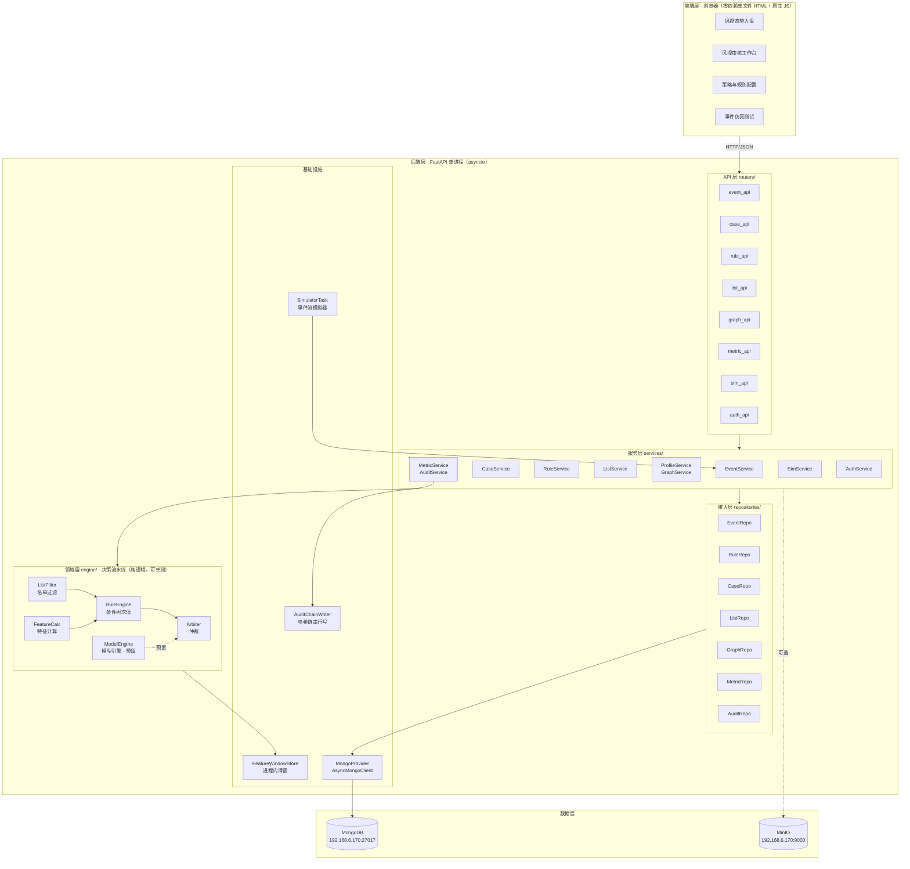
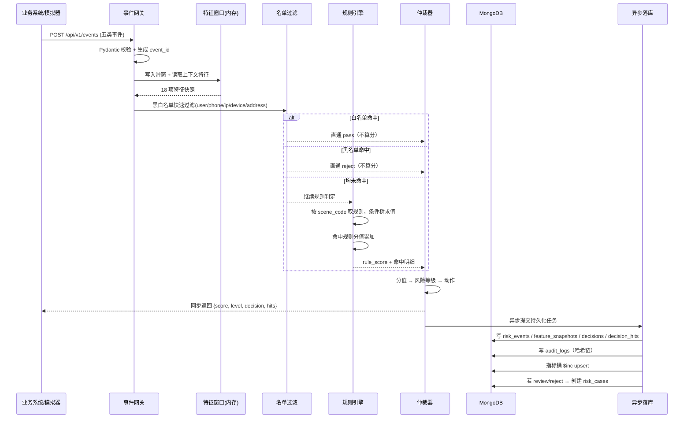
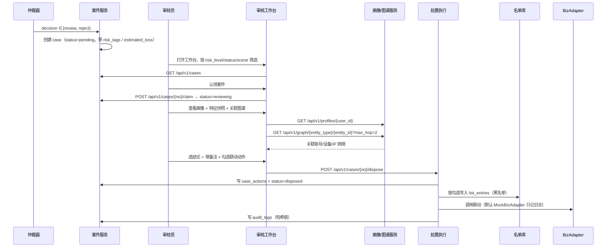
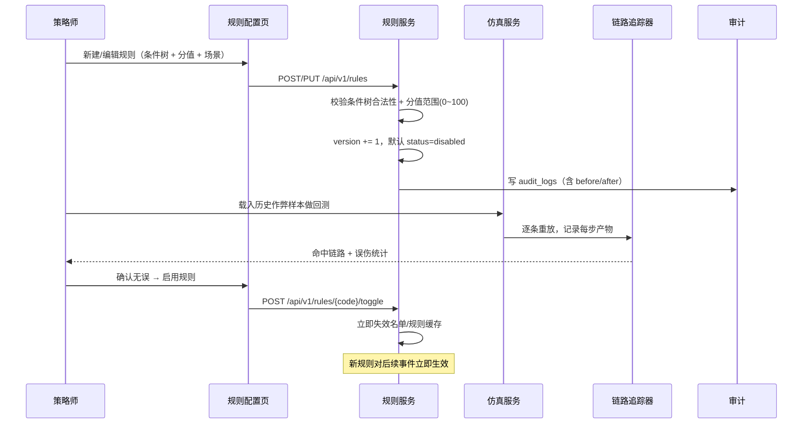

# 电商风险控制系统 · 概要设计

> **文档编号**：02_概要设计
> **所属项目**：shop_risk_control（对应 PRD 2.3 电商风险控制系统）
> **上游依据**：`PRD.md` + `01_数据实体/数据实体设计.md`
> **状态**：Step 2 产物 · 待评审
> **覆盖范围**：技术选型 · 系统架构 · 业务流程 · 数据结构

---

## 1. 技术选型

### 1.1 选型总表

| 层 | 选型 | 版本锚点 | 选定理由 |
|---|---|---|---|
| 语言 | Python | **3.12.8** | 项目定位"纯 Python 项目"；3.12 已在两个项目统一 |
| Web 框架 | **FastAPI** + uvicorn | fastapi 0.141.1 / uvicorn 0.53.0 | 异步原生（决策链路 I/O 密集）、Pydantic 校验、自动 OpenAPI 文档 |
| 数据校验 | Pydantic v2 | 2.13.5 | 与 FastAPI 一体，事件入参校验即"事件网关"的第一道关 |
| 主存储 | **MongoDB** | 共用虚拟机 `192.168.6.170:27017` | 见 1.2 选型论证 |
| Mongo 驱动 | **pymongo `AsyncMongoClient`** | pymongo 4.18.1 | **已实测**：4.9+ 自带异步客户端，**不需要 motor**，少一个依赖 |
| 对象存储 | MinIO | minio 7.2.20 | 共用虚拟机；存仿真用例附件/证据截图（可选） |
| 鉴权 | PyJWT + passlib[bcrypt] | 2.14.0 / 1.7.4 | 无状态 JWT，三角色 RBAC |
| 数据模拟 | Faker + numpy | 40.39.0 / 2.5.3 | 造羊毛党/刷单团伙的规模化事件流 |
| 前端 | **零依赖单文件 HTML + 原生 JS** | — | 对齐 `shopkeeper_brain_teacher_edition` 既有做法（见 1.3） |
| 图表 | **本地 vendor ECharts** | echarts 6.1.0 | 见 1.4 决策点 |
| 测试 | pytest + httpx | 9.1.1 / 0.28.1 | httpx 用于 FastAPI 异步接口测试 |
| 构建工具链 | **无** | — | 不引入 Node/打包器，"纯 Python 项目"约束不破 |

### 1.2 为什么主存储选 MongoDB（而非 SQLite）

| 判据 | MongoDB | SQLite / 关系库 |
|---|---|---|
| **特征快照是动态 KV**（PRD 2.3.8 明确要求"键值结构"） | 原生文档，直接存 + 可对子字段建索引 | 必须序列化成 JSON 塞进一个 TEXT 字段，**失去索引能力** |
| 规则条件树（递归 JSON） | 原生存 object | 需存 JSON 或拆成条件表（**复杂且难维护**） |
| schema 演进（风控规则/画像标签高频变） | 无迁移 | 每次改字段都要 DDL 迁移 |
| 事件流高写入 | 天然适配 | 单文件锁，写并发差 |
| 行业形态 | 风控/画像系统主流选择 | 更像课程作业 |
| 与 knowledge_manager 一致性 | 同机同栈，运维统一 | 引入第二套存储形态 |

**结论**：MongoDB 为主库。`SQLAlchemy + aiosqlite` 依赖保留但**不用于主链路**，预留给将来的离线报表/审计副本。

### 1.3 为什么前端沿用"零依赖单文件 HTML"

已实地核对 `shopkeeper_brain_teacher_edition\knowledge\front\`：

| 事实 | 证据 |
|---|---|
| 两个页面均为单文件 | `chat.html` 833 行、`import.html` 557 行 |
| 外部依赖 0 处 | 无 `<script src>`、无 `<link href>`、无 CDN |
| 通信方式 | `fetch()` 调 REST + `EventSource` 收 SSE |
| 服务方式 | FastAPI `FileResponse` 返回页面 + `StaticFiles` 挂静态目录 |

**沿用该模式**：页面由 FastAPI 直接托管，浏览器打开即用，无需 `npm install`、无需构建、无需 Node。

### 1.4 ⚠️ 决策点 D-01：图表实现方式（**需你确认**）

PRD 2.3.3 要求大盘有**趋势折线图、风险分布环形图、规则命中排行**三类图表，而老师版前端里**没有任何图表库**——这是必须扩展的地方。

| 方案 | 做法 | 优点 | 缺点 |
|---|---|---|---|
| **A. 手写 SVG** | 自己写折线/环形/柱状的 SVG 渲染函数 | 100% 零依赖，最贴合老师风格 | 约 200~300 行；无交互（hover/tooltip/缩放）；动效要手写 |
| **B. 本地 vendor ECharts** ⭐ | `npm pack echarts` → 抽 `echarts.min.js` 放 `static/vendor/`，页面 `<script src="/static/vendor/echarts.min.js">` | **已实测可离线获取**；仍无构建工具、无 CDN、无 Node 运行时依赖；图表效果与交互专业 | 多一个 1MB 静态文件；算引入了第三方库 |

**我的建议：选 B。**理由：PRD 明确要三类图表，且"实时事件滚屏 + 拦截率趋势"需要流畅重绘；手写 SVG 在两天工期里是纯负债。B 方案**不破坏"纯 Python 项目"的性质**——只是多了一个静态文件，运行时无需 Node。
> **请你确认 A 还是 B**，这会影响 Step 3 原型图和 Step 4 前端模块 Spec。

---

## 2. 系统架构

### 2.1 总体分层



### 2.2 模块划分（对齐 PRD 2.3.6 的六个后端模块）

| PRD 模块 | 代码位置 | 职责 | 对应实体 |
|---|---|---|---|
| 事件网关模块 | `api/event_api.py`、`services/event_service.py` | 接收/校验五类事件、分发到决策流水线 | E01 |
| 特征计算引擎 | `engine/feature_store.py`、`engine/feature_calc.py` | 维护滑动窗口缓存、聚合 18 项特征；产出并每日刷新特征基线 | E02 E21 |
| 规则决策引擎 | `engine/list_filter.py`、`rule_engine.py`、`arbiter.py` | 名单匹配 → 条件树求值 → 分值累加 → 仲裁 | E03 E04 E05 E06 E07 |
| 案件流转模块 | `services/case_service.py` | 案件创建、状态机流转、处置动作触发 | E08 E09 |
| 画像与图谱模块 | `services/profile_service.py`、`graph_service.py` | 用户/设备/IP/地址画像聚合、关联网络 | E10 E11 E12 E13 E14 |
| 监控与审计模块 | `services/metric_service.py`、`audit_service.py` | 指标桶增量聚合、哈希链审计 | E15 E16 |

**PRD 之外补充的三个模块**（PRD 未列，但 2.3.3 页面、2.3.10 验收与交付形式要求）

| 补充模块 | 代码位置 | 对应实体 | 为什么必须有 |
|---|---|---|---|
| 仿真测试模块 | `services/sim_service.py`、`engine/tracer.py` | E17 E18 | PRD 2.3.3 有"事件仿真测试页"，2.3.10 验收要"判定链路回溯" |
| 鉴权模块 | `services/auth_service.py` | E19 | PRD 2.3.2 定义了三种角色，页面可见性与接口鉴权依赖它 |
| 事件流模拟器 | `infra/simulator.py` | E01（生产者） | 交付形式要求"模拟电商风险事件流数据集"；真实业务系统不存在，必须有事件源 |

### 2.3 关键架构决策

| 编号 | 决策 | 理由 |
|---|---|---|
| **AD-01** | 决策链路**同步**执行，快照/命中/审计**异步**落库 | PRD 2.3.7 明确"同步返回决策结果，异步持久化"；同步链路只碰内存 + 1 次名单查询，保证低延迟 |
| **AD-02** | 名单查询走**进程内 TTL 缓存**（默认 10s），不每次打 Mongo | 名单是全链路最高频查询；风控名单变化频率低，短 TTL 可接受。**代价**：新加黑名单最多 10s 后生效，需在文档和演示脚本中说明 |
| **AD-03** | 指标桶**写入时增量聚合**（`$inc` upsert），不做查询时聚合 | 大盘每次刷新都全表聚合 `decisions` 会在数据量上来后崩塌 |
| **AD-04** | 审计日志哈希链用**单写者 + asyncio.Lock 串行化** | 哈希链必须线性；并发写会分叉（对应 Step 1 的 G-10） |
| **AD-05** | 特征窗口**纯进程内**，接口抽象为 `FeatureStore` 协议 | 后续可平滑替换为 Redis；当前不引入外部依赖 |
| **AD-06** | 图谱查询**限制 2 跳**，可配置 `max_hop` | 2 跳足以覆盖"同设备账号 → 这些账号的其他设备"这一团伙发现主场景；更高跳数会指数膨胀 |
| **AD-07** | 规则条件用 **JSON 条件树**，不用字符串表达式 | 免注入、可被前端条件树构建器双向绑定（详见 Step 1 E05 设计要点） |
| **AD-08** | 业务系统联动抽象为 **`BizAdapter` 协议**，默认 `MockBizAdapter` | 没有真实业务系统（对应 Step 1 的 G-08） |
| **AD-09** | 模型引擎 `ModelEngine` **只定义协议，返回 `None`** | 对应已确认的 G-01：架构预留、空实现 |

### 2.4 部署形态

```
单机部署（演示形态）
├─ shop_risk_control/
│   ├─ .venv/                     Python 3.12.8
│   ├─ app/                       后端代码
│   ├─ static/                    前端单文件 HTML + vendor/echarts.min.js
│   ├─ scripts/                   数据初始化、事件流模拟入口
│   ├─ tests/                     单元测试 + 接口测试
│   └─ .env                       指向 192.168.6.170
└─ 外部依赖
    ├─ MongoDB  192.168.6.170:27017   （业务库 risk_control）
    └─ MinIO    192.168.6.170:9000    （可选，证据文件）
```

**启动方式**：`uvicorn app.main:app --port 8101`，浏览器打开 `http://127.0.0.1:8101/`。

---

## 3. 业务流程

### 3.1 实时交易风控检测流程（PRD 2.3.7-1）



**时序约束**：`同步返回` 之前的路径**不允许访问 MongoDB**（除 AD-02 的名单 TTL 缓存未命中时的一次查询）。目标 P95 < 50ms。

### 3.2 高危案件调查与处置流程（PRD 2.3.7-2）



### 3.3 风控规则上线与调优流程（PRD 2.3.7-3）



### 3.4 事件流模拟器（演示支撑，非 PRD 要求但必须有）

```
SimulatorTask（asyncio 后台任务）
├─ 模式1 正常流：按 base_rate 生成常态事件（多数 pass）
├─ 模式2 羊毛党：10 个新账号 + 同 device_id + 同 ip，60s 内密集领券
├─ 模式3 刷单：同 sku 高频下单支付，地址聚集
└─ 模式4 恶意退款：老账号高额订单 → 密集"未收到货"退款申请

可配置：速率(events/sec)、场景开关、随机种子(保证演示可复现)
```

> **可复现性要求**：所有模拟事件必须支持**固定随机种子**，保证同一场景每次演示结果一致——这是答辩现场不翻车的关键。

---

## 4. 数据结构（承接 Step 1）

### 4.1 Mongo 集合与索引（实现态）

| 集合 | 实体 | 主键 | 关键索引 | 保留策略 |
|---|---|---|---|---|
| `risk_events` | E01 | `EVT*` | `user_id+ts desc`；`device_id+ts desc`；`ip+ts desc`；`event_type+ts desc` | TTL 90 天 |
| `feature_snapshots` | E02 | `SNP*` | 唯一 `event_id`；`user_id+computed_at desc` | TTL 90 天 |
| `decisions` | E03 | `DEC*` | 唯一 `event_id`；`decided_at desc`；`decision+decided_at desc` | 永久 |
| `decision_hits` | E04 | `HIT*` | `decision_id`；`rule_code+hit_at desc` | 永久 |
| `rules` | E05 | `R*` | `scene_code+status+priority` | 永久 |
| `rule_scenes` | E06 | 场景码 | — | 永久（种子数据） |
| `list_entries` | E07 | `L*` | **唯一** `list_type+entity_type+entity_value+status`；`expire_at` | 永久（含过期态） |
| `risk_cases` | E08 | `CASE*` | 唯一 `event_id`；`status+risk_level+created_at desc`；`user_id+created_at desc` | 永久 |
| `case_actions` | E09 | `ACT*` | `case_no`；`acted_at desc` | 永久 |
| `users` | E10 | `U*` | `linked_user_cnt` 由图谱侧维护；`risk_tags` | 永久 |
| `devices` | E11 | `device_id` | `linked_user_cnt desc`（聚集度排序） | 永久 |
| `ip_pool` | E12 | `ip` | `linked_user_cnt desc`；`is_proxy` | 永久 |
| `user_addresses` | E13 | `address_id` | `linked_user_cnt desc`；`aftersale_cnt desc` | 永久 |
| `entity_edges` | E14 | `EDGE*` | `from_type+from_id`；`to_type+to_id`；唯一 `from_id+to_id+relation` | 永久 |
| `metric_buckets` | E15 | `{type}:{key}:{ts}` | 唯一 `_id`；`bucket_type+bucket_ts desc` | `1m` 粒度 TTL 7 天 |
| `audit_logs` | E16 | `LOG*` | `ts desc`；`actor+ts desc`；`target_type+target_id` | 永久 |
| `feature_baselines` | E21 | `{feature}:{segment}` | 唯一 `_id`；`feature_name+segment` | 永久（每日覆盖） |
| `sim_cases` | E17 | `SIMC*` | `category` | 永久 |
| `sim_runs` | E18 | `SIMR*` | `run_at desc`；`case_id` | 永久 |
| `sys_users` | E19 | 账号 | 唯一 `username` | 永久 |
| `model_configs` | E20 | 配置 ID | — | 永久（当前空实现） |

### 4.2 进程内滑动窗口结构

```python
@dataclass(slots=True)
class EventLite:
    ts: int
    event_type: str
    user_id: str
    device_id: str | None
    ip: str | None
    address_id: str | None
    amount: int

class InMemoryFeatureStore:          # 实现 FeatureStore 协议
    _all:       deque[EventLite]                 # 全局，按 ts 递增
    _by_user:   dict[str, deque[EventLite]]
    _by_device: dict[str, deque[EventLite]]
    _by_ip:     dict[str, deque[EventLite]]
    _by_addr:   dict[str, deque[EventLite]]
    _linked:    dict[str, set[str]]              # entity_key -> {user_id}
    # 约束：每条 deque 上限 10000（G-12 已确认）
    # 清理：asyncio 定时任务每 60s 扫一次，丢弃超过 long_window 的条目
```

**为什么 `_linked` 单独维护**：`device_user_cnt`（同设备账号数）是团伙识别的核心指标，若每次现场扫描全部事件会退化成 O(n)；单独维护去重集合后是 O(1)。

### 4.3 指标桶聚合写入

```python
await metric_col.update_one(
    {"_id": f"global:all:{bucket_ts_1m}"},
    {"$inc": {"metrics.event_cnt": 1, "metrics.reject_cnt": is_reject},
     "$setOnInsert": {"bucket_type": "global", "granularity": "1m", ...}},
    upsert=True,
)
```
同时按 `rule` / `level` / `scene` 三种维度各 upsert 一次 → 大盘四类图表全部由桶直接读出，**不扫明细**。

### 4.4 审计哈希链

```python
# 单写者：全程持有 asyncio.Lock，保证链不分叉（AD-04）
async with audit_lock:
    prev = await col.find_one(sort=[("ts", -1)])
    prev_hash = prev["hash"] if prev else "GENESIS"
    body = f"{prev_hash}|{actor}|{action}|{target_id}|{ts}|{canonical_json(after)}"
    doc = {..., "prev_hash": prev_hash, "hash": sha256(body)}
    await col.insert_one(doc)
```
**校验接口**：`GET /api/v1/audit/verify` 从创世块重算全链哈希，返回首个不一致位置——这是"不可篡改"可被验收的直接证据。

---

## 5. 接口总览

> 详细的字段级定义放在 **Step 4 模块 Spec**，此处只固化**路由分层与职责边界**，防止后续模块间接口打架。

| 分组 | 方法与路径 | 职责 | 角色 |
|---|---|---|---|
| 事件 | `POST /api/v1/events` | 接收单条事件，**同步返回决策** | 系统间 |
| | `POST /api/v1/events/batch` | 批量接收（模拟器/压测用） | 系统间 |
| | `GET /api/v1/events/{event_id}` | 查事件详情 | 全部 |
| 案件 | `GET /api/v1/cases` | 案件列表（筛选/分页） | reviewer/admin |
| | `GET /api/v1/cases/{case_no}` | 案件详情（含快照+命中+处置） | reviewer |
| | `POST /api/v1/cases/{case_no}/claim` | 认领 | reviewer |
| | `POST /api/v1/cases/{case_no}/dispose` | 处置（结论+备注+联动动作） | reviewer |
| 规则 | `GET/POST/PUT/DELETE /api/v1/rules` | 规则 CRUD | strategist |
| | `POST /api/v1/rules/{code}/toggle` | 启停用 | strategist |
| | `GET /api/v1/rule-scenes` | 场景字典 | 全部 |
| 名单 | `GET/POST/DELETE /api/v1/lists` | 名单维护 | strategist |
| | `POST /api/v1/lists/import` | 批量导入 | strategist |
| 画像图谱 | `GET /api/v1/profiles/{user_id}` | 用户全貌画像 | reviewer |
| | `GET /api/v1/graph/{entity_type}/{entity_id}` | 关联网络（`max_hop`≤2） | reviewer |
| 大盘 | `GET /api/v1/metrics/overview` | 核心指标卡片 | 全部 |
| | `GET /api/v1/metrics/trend` | 拦截率/请求量趋势 | 全部 |
| | `GET /api/v1/metrics/distribution` | 风险等级/场景分布 | 全部 |
| | `GET /api/v1/metrics/rule-ranking` | 规则命中排行 | 全部 |
| | `GET /api/v1/metrics/stream` | **SSE** 实时事件流 | 全部 |
| 仿真 | `GET /api/v1/sim/cases` | 用例模板 | 全部 |
| | `POST /api/v1/sim/run` | 单条模拟检测（返回完整链路） | reviewer/strategist |
| 审计 | `GET /api/v1/audit/logs` | 审计流水 | admin |
| | `GET /api/v1/audit/verify` | **哈希链完整性校验** | admin |
| 鉴权 | `POST /api/v1/auth/login` | 登录换 JWT | 全部 |
| | `GET /api/v1/auth/me` | 当前用户与权限 | 全部 |
| 系统 | `GET /health` | 健康检查（含 Mongo 连通性） | — |
| | `GET /api/v1/system/stats` | 吞吐/延迟统计 | admin |

---

## 6. 非功能设计

| 维度 | 设计 | 目标值 |
|---|---|---|
| 决策延迟 | 同步链路不碰 Mongo（除名单缓存未命中） | P95 < 50ms |
| 吞吐 | 单进程 asyncio；模拟器可灌压 | ≥ 200 events/sec（演示量级） |
| 名单生效延迟 | TTL 缓存 10s | ≤ 10s |
| 一致性 | 决策结果同步返回；落库失败**不回滚决策**，转入重试队列并告警 | 最终一致 |
| 幂等 | `POST /events` 支持 `event_id` 幂等（重复提交返回首次决策，不重复计分） | 必须 |
| 异常 | 统一 `exception_handler`，返回 `{code, message, trace_id}`；领域异常细分（见 Step 4） | — |
| 可观测 | 结构化日志（trace_id 贯穿）+ `/api/v1/system/stats` | — |
| 安全 | 手机号/地址脱敏存储；规则条件树免注入；JWT + 角色鉴权 | — |
| 可复现 | 模拟器固定随机种子；事件生成可重放 | 必须 |

---

## 7. 与 Step 1 的一致性核对

| Step 1 遗留问题 | 本步结论 |
|---|---|
| E20 模型配置的实现深度 | **AD-09**：只定义 `ModelEngine` 协议，返回 `None`；`model_configs` 集合留空 |
| E14 图谱多跳深度 | **AD-06**：默认 2 跳，`max_hop` 可配 |
| E15 指标桶聚合触发方式 | **AD-03**：写入时 `$inc` upsert 增量聚合 |
| `list_entries` 写入时机 | 同步写（处置动作内，低频，需立即生效） |
| `entity_edges` 写入时机 | **异步**补写（避免拖慢决策链路；图谱允许最终一致） |

**实体覆盖核对**：Step 1 的 E01~E20 全部在 2.2 模块表或 4.1 集合表中出现，无实体被漏接。

---

## 8. 本步遗留决策点

| 编号 | 决策点 | 状态 |
|---|---|---|
| **D-01** | 图表用「手写 SVG」还是「本地 vendor ECharts」 | ⚠️ **待你确认**（建议 B） |
| D-02 | 前端页面是 4 个独立 HTML，还是 1 个单页 + 路由切换 | Step 3 确定 |
| D-03 | 事件流模拟器的默认速率与场景权重 | Step 4 确定 |
| D-04 | 是否引入 Redis 替换进程内窗口 | 当前不引入，留接口 |
