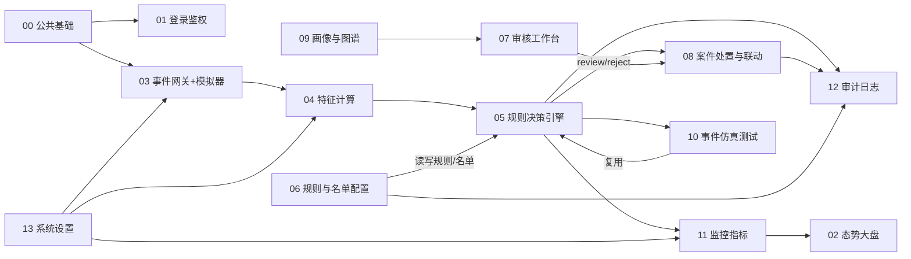

# 电商风险控制系统 · 模块划分与边界

> **文档编号**：04_模块Spec / 00_总纲
> **所属项目**：shop_risk_control
> **上游依据**：`PRD.md` + `01_数据实体` + `02_概要设计` + `03_原型图`

---

## 1. 为什么先定边界

PRD 把模块拆成「前端模块（2.3.5）」和「后端模块（2.3.6）」两套清单，两边**存在同名重叠**：

- 后端有 `规则决策引擎模块`（2.3.6），前端有 `策略配置模块`（2.3.5）
- 后端有 `案件流转模块`（2.3.6），前端有 `审核工作台模块` + `处置交互模块`（2.3.5）

如果不先划清边界，14 份文档会出现**同一段规则被写两遍、且两遍不一致**的经典问题。
**划界原则**：按**「决策时（runtime）」与「管理时（admin-time）」**切分，而不是按前后端切分。

---

## 2. 十四个模块

| # | 模块 | 类型 | 一句话职责 | 对应 PRD | 主要实体 | 对应原型 |
|---|---|---|---|---|---|---|
| 00 | 公共基础与项目骨架 | 基建 | 项目结构、配置、Mongo 连接、单页壳、HTTP 客户端、枚举与错误码 | — | — | 全部页面外壳 |
| 01 | 登录与权限鉴权 | 页面+服务 | JWT 登录、三角色 RBAC、菜单与按钮可见性、接口 403 | 2.3.2 | E19 | 01、09 |
| 02 | 态势大盘 | 页面 | 指标卡片、三类图表、SSE 实时事件流、下钻跳转 | 2.3.3 | E15 | 02 |
| 03 | 事件接入网关与事件流模拟器 | 引擎 | 五类事件校验、幂等、分发决策链路；模拟器生成可复现事件流 | 2.3.1、2.3.7-1 | E01 | 05（参数部分） |
| 04 | 特征计算引擎 | 引擎 | 滑动窗口维护、18 项特征聚合、快照落库、缺失标记 | 2.3.1、2.3.6 | E02 | 03（快照表）、05（步骤2） |
| 05 | **规则决策引擎（决策时）** | 引擎 | 名单快速过滤 → 条件树求值 → 分值累加 → 仲裁分级 | 2.3.1、2.3.4 | E03 E04 | 03（命中明细） |
| 06 | **规则与名单配置管理（管理时）** | 页面+服务 | 规则 CRUD/启停用/版本、条件树构建器、黑白灰名单库维护与批量导入 | 2.3.3、2.3.4 | E05 E06 E07 | 04 |
| 07 | 案件审核工作台 | 页面 | 案件多维筛选、列表分页、三栏联动（画像/证据/图谱） | 2.3.3 | E08 | 03 |
| 08 | 案件处置与业务联动 | 引擎+交互 | 认领、处置结论与动作、二次确认、名单联动写入、BizAdapter、审计落库 | 2.3.4、2.3.7-2 | E08 E09 | 03（右栏）、06 |
| 09 | 画像与关联图谱 | 引擎 | 用户/设备/IP/地址画像聚合、2 跳关联网络、团伙发现 | 2.3.1、2.3.6 | E10~E14 | 03（中栏） |
| 10 | 事件仿真测试 | 页面+服务 | 用例模板、事件参数表单、复用真实链路单步回放、误伤统计 | 2.3.3、2.3.10 | E17 E18 | 05 |
| 11 | 监控指标引擎 | 引擎 | 指标桶增量聚合、四类统计口径、对外查询接口 | 2.3.3、2.3.6 | E15 | 02 |
| 12 | 审计日志 | 页面+服务 | 哈希链写入与全链校验、审计流水查询与导出 | 2.3.2、2.3.4 | E16 | 07 |
| 13 | 系统设置与运行参数 | 页面+服务 | 运行参数、吞吐健康度、账号与角色管理、模型引擎预留配置 | 2.3.2 | E19 E20 | 08 |

**共 14 个模块。**

---

## 3. 边界裁定（防重叠的关键三条）

### 3.1 模块 05 vs 06：决策时 vs 管理时

| 关注点 | 05 规则决策引擎 | 06 规则与名单配置管理 |
|---|---|---|
| 触发时机 | 每个事件进来时（高频，P95<50ms） | 人工操作时（低频） |
| 做什么 | **读**规则与名单 → 求值 → 打分 → 仲裁 | **写**规则与名单 → 校验 → 版本 → 审计 |
| 名单 | 只做**快速过滤**（缓存读取，命中即直通） | 负责名单的增删改、批量导入、过期清理 |
| 条件树 | 实现**求值器** `evaluate(tree, features) -> bool` | 实现**编辑器**（前端构建器）+ **结构校验器** |
| 接口归属 | `POST /api/v1/engine/evaluate`（供仿真复用） | `GET/POST/PUT/DELETE /api/v1/rules`、`/api/v1/lists` |
| 共享代码 | 共享 `rule.schema`（条件树数据结构）与 `condition_op` 枚举 | 同左 |

> **裁定**：**条件树的「结构定义」与「求值算法」属于 05**；**条件树的「编辑 UI」与「保存前校验」属于 06**。06 必须调用 05 暴露的 `validate_tree()`，**不得自己再实现一遍校验**。

### 3.2 模块 02 vs 11：展示 vs 计算

| 关注点 | 02 态势大盘（页面） | 11 监控指标引擎 |
|---|---|---|
| 职责 | 调接口、渲染、交互、超时与空态 | 增量聚合、口径计算、时间桶对齐、查询接口 |
| 禁止 | **禁止页面自己算拦截率** | — |
| 接口 | 消费 `GET /api/v1/metrics/*` | 提供 `GET /api/v1/metrics/*` |

> **裁定**：**所有百分比、均值、排行的计算都在 11**；02 只做格式化展示（如 `4.7%`）。

### 3.3 模块 03 vs 04 vs 05：链路顺序上的严格分工

```
事件 → [03 校验/幂等] ─┬─→ [04 特征快照]────────┐
                        └─→ [05 名单快速过滤]────┴─→ [05 规则求值+仲裁] → 返回决策

> **[决策 D4]** 特征快照与名单快速过滤**并行执行**（两者互不依赖：前者读内存窗口，后者查 Mongo/缓存），两者都完成后才进入规则求值。此处原为串行裁定，与 PRD 2.3.7-1「**并行**计算实时上下文特征快照」冲突，已按 PRD 修正。
                                              ↓ 异步
                            [11 指标桶] [12 审计] [07 案件(若 review/reject)] [09 图谱边]
```

> **裁定**：03 不碰特征、04 不碰规则、05 不碰落库（除 decisions/decision_hits）。**落库由各归属模块的异步任务负责**（AD-01）。

---

## 4. 依赖关系



---

## 5. 每份模块 Spec 的统一结构（六章必备）

| 章节 | 必须写清 |
|---|---|
| **1. 模块定位** | 职责、上下游、对应 PRD 条目、对应实体（E 编号）、对应原型页 |
| **2. 页面结构** | 该模块的展示点（引擎类模块写"它出现在哪些页面的哪个位置"）；元素清单、字段绑定、交互、状态与空态 |
| **3. 接口字段** | 路由 / 方法 / 请求字段（名、类型、必填、约束）/ 响应字段 / 状态码 / 幂等性 |
| **4. 业务规则** | 可判定的规则，逐条编号（如 BR-05-01），引用 PRD 与 AD 编号 |
| **5. 异常处理** | 异常清单 + 错误码 + HTTP 状态码 + 用户可见提示 + 降级策略 |
| **6. 文件规划** | 目录树 + 每个文件的职责（一文件一句） |
| **7. 验收标准** | 与 PRD 2.3.10 对齐，逐条可测（含"如何验证"） |

> 每份文档末尾附 **「本模块遗留与待确认」**，汇总该模块涉及的悬空点（G-xx）。

---

## 6. 统一错误码前缀（**一个模块一个前缀**）

| 前缀 | 模块 | 4xxx 用于 | 5xxx 用于 |
|---|---|---|---|
| `COM` | 00 公共基础与项目骨架 | 请求格式、参数校验、限流 | 未捕获异常、DB 连接、配置缺失 |
| `AUTH` | 01 登录与权限鉴权 | 登录失败、令牌无效、越权 | 鉴权依赖不可用 |
| `DASH` | 02 态势大盘 | — | SSE 连接与推送异常 |
| `EVT` | 03 事件接入网关与模拟器 | 事件体非法、幂等冲突、模拟器参数 | 落库失败、分发失败 |
| `FEA` | 04 特征计算引擎 | 事件编号非法、快照不存在 | 计算异常、落库失败、窗口截断 |
| `RUL` | 05 规则决策引擎 | 事件体非法、条件树非法 | 名单/规则加载失败、求值异常 |
| `CFG` | 06 规则与名单配置管理 | 规则/名单校验、版本冲突、权限 | 写库失败、名单降级、审计失败 |
| `CASE` | 07 案件审核工作台 | 案件不存在、认领冲突、查询参数 | 详情聚合超时、图谱/画像降级 |
| `DSP` | 08 案件处置与业务联动 | 处置参数、结论动作不相容、状态冲突 | 状态写入、名单联动、同步、审计失败 |
| `GRP` | 09 画像与关联图谱 | `max_hop` 越界、实体不存在 | 聚合失败、图查询超时 |
| `SIM` | 10 事件仿真测试 | 事件体非法、JSON 非法、条数超限 | 引擎不可用、记录落库失败 |
| `MET` | 11 监控指标引擎 | `range`/`granularity`/`top`/`dim` 非法 | 查询降级、写入失败、SSE 超限 |
| `AUD` | 12 审计日志 | 校验参数、导出超限、时间跨度过大 | 链路写入失败、篡改检出 |
| `SYS` | 13 系统设置与运行参数 | 参数越界、账号冲突、保护性拒绝 | 配置保存失败、账号写入失败 |

**强制规则**

| 编号 | 规则 |
|---|---|
| **ER-01** | **一个模块一个前缀，禁止两个模块共用前缀**。共用会导致「同号不同义」——前端拿到 `XXX-4001` 无法判断该提示什么 |
| **ER-02** | 同一错误码在全项目**唯一**；引用其他模块的错误码时**保持原前缀**（如 03 引用 05 的 `RUL-5004`），不得改写成自己的前缀 |
| **ER-03** | 纯消费型页面（如 02）只在**确有本模块独有错误**时才定义自己的前缀；其余条件一律引用上游模块的码 |

> **修订记录（交叉校验发现并已修复）**
> 初版按「模块组」分配前缀（`02/11→MET`、`05/06→RUL`、`07/08→CAS`），交叉校验发现其中三对模块**各自定义了同号不同义**的错误码：
> - `CAS-4001`：07 是"案件不存在"，08 是"处置参数非法"
> - `RUL-4001`：05 是"事件体非法"，06 是"规则不存在"
> - `MET-5003`：02 是"SSE 建立失败"，11 是"延迟统计缺失"
>
> 已改为**一个模块一个前缀**（06→`CFG`、07→`CASE`、08→`DSP`、02→`DASH`），并顺带修正 07 对 08 的一处**错误交叉引用**（原指向 08 的「确认令牌无效」，语义实为「案件状态不允许该操作」，已改为 `DSP-4003`）。

---

## 7. 待确认

| # | 事项 | 建议 |
|---|---|---|
| S4-1 | 上述 14 个模块划分是否认可？尤其 **05/06 按「决策时/管理时」切分**这一裁定 | 认可则按此产出 13 份 |
| S4-2 | 模块 Spec 的**格式**是否认可？（见 `05_规则决策引擎.md` 样例） | 认可则批量产出 |
